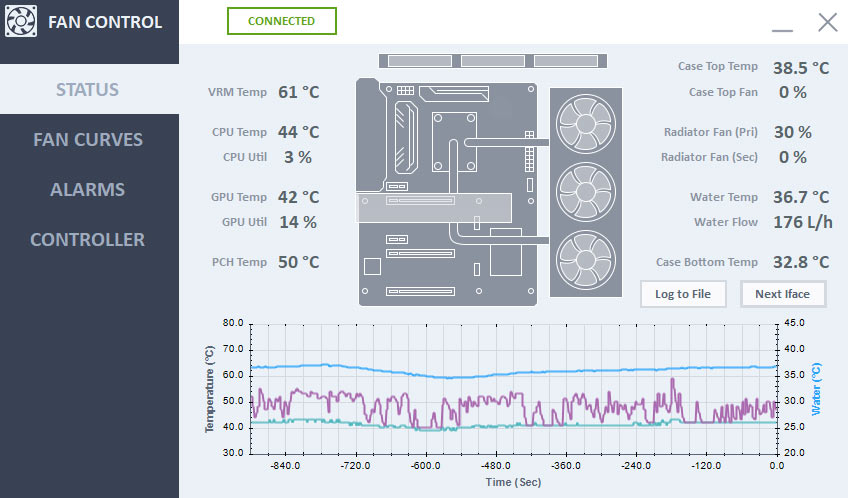
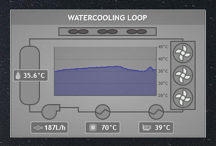

Software
==========================
 

Overview
--------

The software interface for PC allows for monitoring and changing settings on the fan controller. It is also responsible for transmitting data from the PC to the fan controller for display e.g. CPU / GPU temperature. 

**Important Note:** This software uses hard coded arrays from OpenHardwareMonitor. To use this software and read out computer related information will require you to use the debugger and select the correct values as described below under "Open Hardware Monitor". Failure to do so will result in 0 being displayed for CPU / GPU / VRM temperature and load at best or array overflows at worst. 

#### Features ####
- Integrates with LibreHardwaremonitor.lib to read PC monitored values (e.g. CPU / GPU / VRM Temp)
- Serial communication with the Fan Controller to display current measured values and outputs from the controller.
- Graphs of CPU GPU and Water temperature. 
- Logs of all displayed values to a file.
- Changes the active interface displayed on the fan controller.
- Changes the three control curves for the three fan outputs on the controller (two point linear control). 
- Displays the three curves and operating points in realtime. 
- Changes the alarm setpoints on the fan controller. 
- Displays diagnostic information of the communications link.
- Outputs CSV data to a temporary file in the user's temp folder (Fanctl.tmp) for reading with Rainmeter (see Rainmeter meter folder for details)

 

Design Explaination
-------------------

#### Communication ####

The Communication interface itself is described in the firmware section. Described below is only the computer software handling. 

When first starting the software it attempts to connect on the previously used COM port.
On connection the software will request and read back the current Fan settings, and the current alarm settings and store them to memory. 

When modifying fan settings or alarms settings a respective button in each tab will write the updated values to the fan controller. Additionally a button on the main window will trigger the fan controller to change interface. These communication commands are one-way and not verified. 

On receiving data from the controller which happens periodically the following actions are taken:

1. If we have not received a ';' indicating the end of the command, add it to a temporary string "SerialData" and move on. 
2. Otherwise split the Serialdata string using ':' into SerialWords array.
3. Check the first word in the array for the appropriate command, ensure the correct number of words were received for any given command, and add each word to the correct variable:
   * 'V' - 7 Values - Command contains new values. Update the values variables and display.
   * 'A' - 13 Values (only 8 are required) - Command contains current alarm settings in the controller. Update the alarm variables and display. 
   * 'F' - 16 Values - Command contains current fan settings in the controller. Update the fan variables and display.

The remainder of the software triggers on a timer event. On each trigger of the timer the following occurs:

1. System information is read using the OpenHardwareMonitor library. 
2. A background worker is triggered to update all UI elements from the current values (whether they have been updated or not).
3. If the COM port is connected then system information is sent to the fan controller.
4. The graphs are updated. 

#### Open Hardware Monitor (Libre) ####

This software uses a fork of the OpenHardwareMonitor library called LibreHardwareMonitor https://github.com/LibreHardwareMonitor/LibreHardwareMonitor. Unlike OpenHardwareMonitor this version is still maintained actively. The library allows 3rd party software to read system information without requiring other monitoring software to run. 

This software reads 6 system values:
- CPU Temperature and Utilisation
- GPU Temperature and 3D Utilisation
- VRM Temperature
- System PCH Temperature

These values are read out statically from the LibreHardwareMonitor arrays. Conditional statements are provided as only a brief sense check. 

**Note:** The following lines will need to be changed under "public void GetSystemInfo(int index)" to suit your system as they are system specific:

```C
if (computer.Hardware[i].HardwareType == HardwareType.CPU)
{
	if (computer.Hardware[i].Sensors[19].SensorType == SensorType.Temperature)
	{
		CPU_Temp[index] = Math.Round((double)computer.Hardware[i].Sensors[19].Value);
	}
	if (computer.Hardware[i].Sensors[16].SensorType == SensorType.Load)
	{
		CPU_Perc = Math.Round((double)computer.Hardware[i].Sensors[16].Value);
	}
}
else if (computer.Hardware[i].HardwareType == HardwareType.GpuNvidia)
{
	if (computer.Hardware[i].Sensors[0].SensorType == SensorType.Temperature)
	{
		GPU_Temp = (double)computer.Hardware[i].Sensors[0].Value;
	}
	if (computer.Hardware[i].Sensors[5].SensorType == SensorType.Load)
	{
		GPU_Perc = Math.Round((double)computer.Hardware[i].Sensors[5].Value);
	}
}
else if (computer.Hardware[i].HardwareType == HardwareType.Mainboard)
{
	if (computer.Hardware[i].SubHardware[0].Sensors[6].SensorType == SensorType.Temperature)
	{
		VRM_Temp = (double)computer.Hardware[i].SubHardware[0].Sensors[6].Value;
	}
	if (computer.Hardware[i].SubHardware[0].Sensors[2].SensorType == SensorType.Temperature)
	{
		SYS_Temp = (double)computer.Hardware[i].SubHardware[0].Sensors[2].Value;
	}
}
```

In each case the Sensor[#] array index needs to be adjusted as these vary between systems. Some motherboards additionally have multiple sensor controllers and as such the SubHardware[#] array index may need to be adjusted or removed.

The easiest way to go about this is to set a breakpoint in the software and using the debugger inspect the array for the correct value as read out by other monitoring software. 
This could be neater. 


